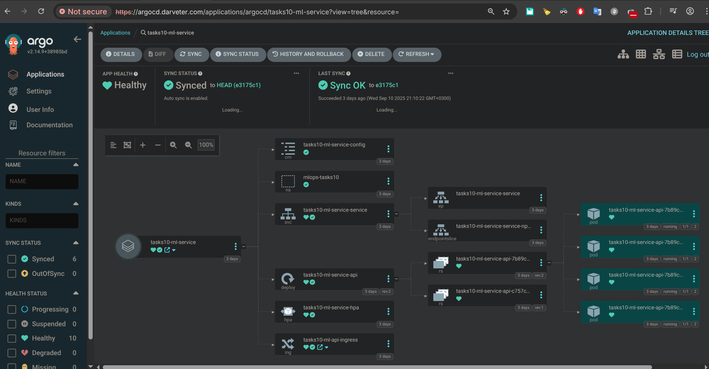
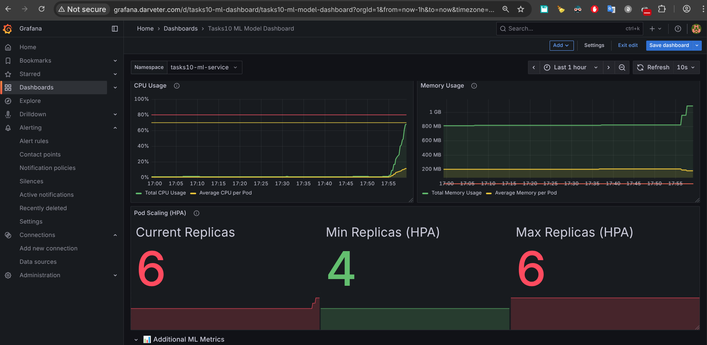
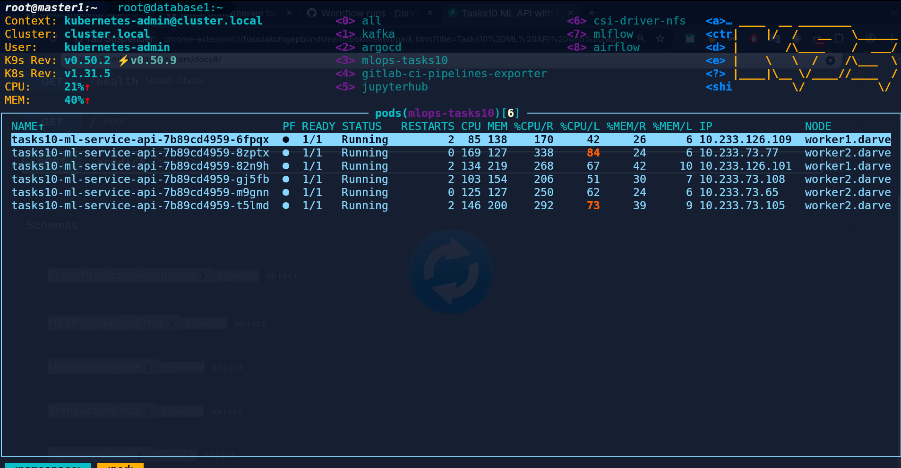
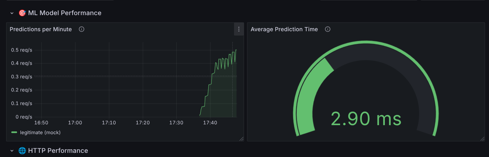
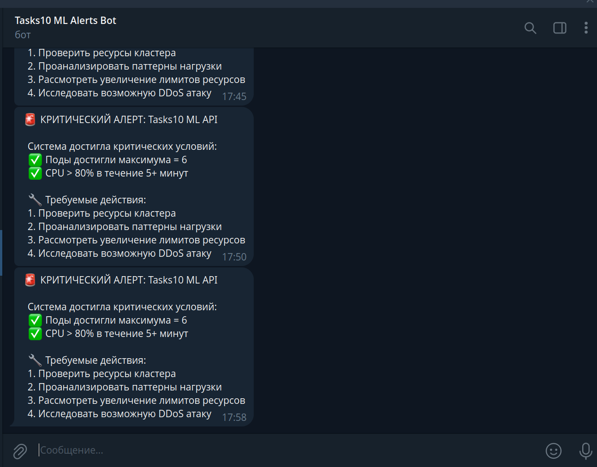
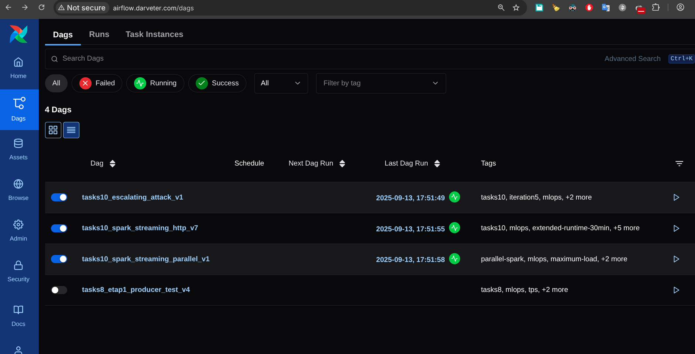
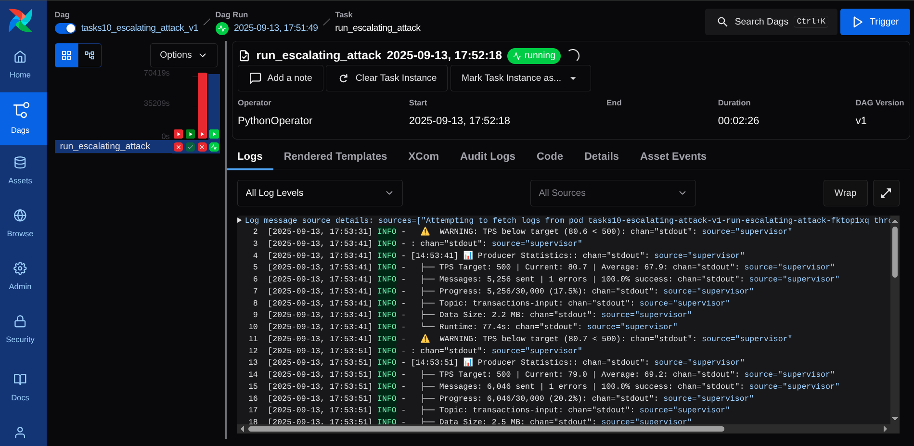
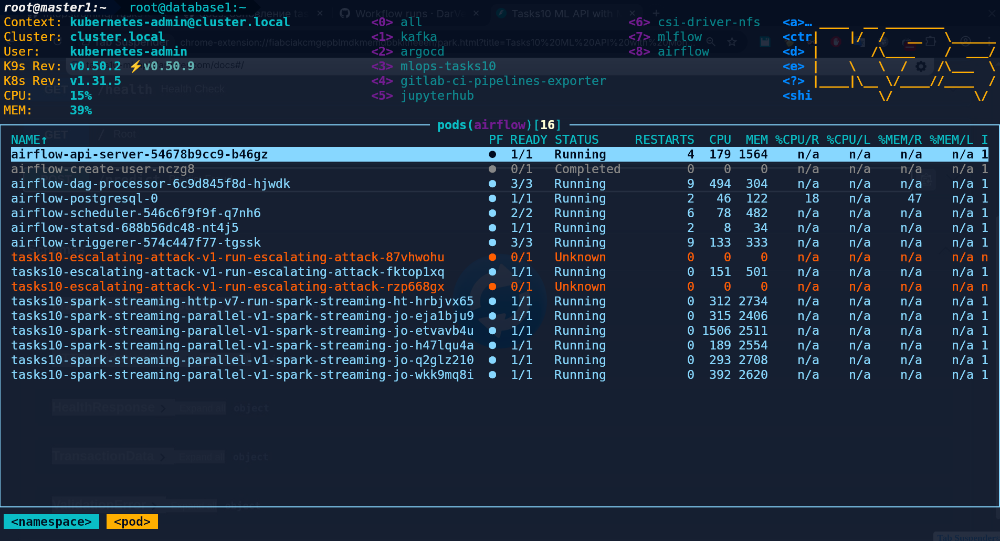
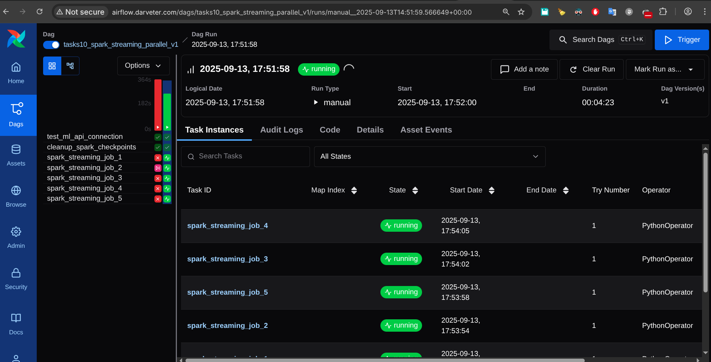

# Развертывание модели

**Домашнее задание №10**  
**Курс MLOps**  
**Образовательная платформа «Otus»**

## Цель работы

В данном домашнем задании Вы потренируетесь в развертывании модели в Kubernetes кластере и мониторинга метрик его работы. Вам предстоит развернуть модель в облачном Kubernetes кластере и настроить контроль метрик его состояния. Так же подготовить уведомления в случае нарушения режимов работы.

## Описание проекта

> Поздравляю! Ваша модель прошла тестирование и руководство приняло решение разворачивания ее в production среду. По результатам тестирования быстродействия было решено, что вполне достаточно развернуть 4 экземпляра модели.
> 
> Вас немного беспокоит вопрос, справится ли ваша модель в периоды пиковой нагрузки и не стоит ли увеличить то число до 6, но вы решили настроить политику развертывания таким образом, что модель будет автоматически масштабироваться до 6 экземпляров в случае пиковой нагрузки.
> 
> Вместе с тем вы понимаете, что конкуренты могут попробовать организовать DDoS атаку, чтобы скомпрометировать новый сервис и автоматическое масштабирование приведет с неоправданным тратам ресурсов за облачную инфраструктуру.

## Требования к масштабированию

### Автоматическое масштабирование

Из сказанного выше вытекает необходимость настройки незначительного масштабирования, которое покроет периоды пикового спроса и внедрение системы алертинга при дальнейшем росте нагрузки.

С помощью сервера Prometheus и Grafana вам нужно настроить мониторинг параметров работы Kubernetes кластера и уведомление системного администратора в случае превышения нагрузки на любом из 6 экземпляров модели выше 80%.

## Задания

Решение будет ожидаться в виде репозитория/ветки на GitHub, с terraform конфигурациями, k8s манифестами и другим необходимым кодом для запуска всей системы.

### Обязательные задания

✅1. **Настроить политику развертывания модели** в кластере Kubernetes от 4 до 6 экземпляров и развернуть модель.

**Реализовано через:**
- **GitOps (ArgoCD)**: [`argocd/application.yaml`](./argocd/application.yaml) - автоматическая синхронизация из Git репозитория
- **Kubernetes Deployment**: [`argocd/manifests/deployment.yaml`](./argocd/manifests/deployment.yaml) - базовая конфигурация ML API подов  
- **HorizontalPodAutoscaler**: [`argocd/manifests/hpa.yaml`](./argocd/manifests/hpa.yaml) - автоматическое масштабирование:
  - `minReplicas: 4` - минимум 4 пода
  - `maxReplicas: 6` - максимум 6 подов  
  - Триггеры: CPU > 80% или Memory > 70%
- **Текущее состояние**: 4 активных пода, готовых к масштабированию до 6

**Развертывание ML модели в ArgoCD:**

На скриншоте видно успешное развертывание ML API сервиса через ArgoCD с автоматической синхронизацией из Git репозитория. Все компоненты (Deployment, Service, HPA, ConfigMap, Ingress) находятся в состоянии "Synced" и "Healthy", что подтверждает корректную работу GitOps процесса развертывания модели.

✅2. **Настроить сервер Prometheus** для мониторинга параметров кластера и качества работы вашей модели. Настройте отображение метрик в виде графиков с помощью Grafana.

**Реализовано через:**
- **Prometheus Server**: автоматически собирает метрики с ML API подов
- **Grafana Dashboard**: [`monitoring/dashboards/ml-model-dashboard.json`](./monitoring/dashboards/ml-model-dashboard.json) - комплексный мониторинг

**Мониторируемые данные:**

🚀 **System Resources & Scaling:**
- `container_cpu_usage_seconds_total` - использование CPU подами (общее и среднее)
- `container_memory_usage_bytes` - использование памяти подами
- `kube_deployment_status_replicas` - текущее количество реплик
- `kube_horizontalpodautoscaler_spec_min/max_replicas` - лимиты HPA (4-6 подов)

**Grafana Dashboard - CPU & RAM Attack Monitoring:**

**Grafana Dashboard - System Resources:**

На скриншотах показана работа системы под нагрузкой:
- **CPU Usage**: Видно рост использования CPU до 70% с красной линией порога на 80%
- **Memory Usage**: Стабильное потребление памяти около 200MB с ростом до 1GB
- **Pod Scaling (HPA)**: Автомасштабирование сработало - Current Replicas показывает **6** (достигнут максимум), Min=4, Max=6
- **Критический статус**: Красные индикаторы Current и Max Replicas сигнализируют о достижении лимитов масштабирования

🎯 **ML Model Performance:**
- `ml_model_predictions_total` - счетчик предсказаний модели, увеличивается на +1 при каждом вызове `/predict`, группируется по меткам `result_type` (fraud/legitimate)
- `ml_model_prediction_duration_seconds` - гистограмма времени выполнения предсказаний в секундах, измеряется от начала обработки запроса до возврата результата, автоматически вычисляет среднее, медиану и перцентили

**Grafana Dashboard - ML Model Performance:**

На скриншоте показана работа дашборда мониторинга ML модели в реальном времени:

🎯 **Predictions per Minute**: График показывает интенсивную активность модели с пиковыми значениями до **1.2 запросов в секунду** в период с 16:50 до 17:40. Видно значительные всплески нагрузки на ML API, что соответствует проведению нагрузочного тестирования системы.

⏱️ **Average Prediction Time**: Gauge показывает среднее время ответа модели **2.90 ms**, что является отличным показателем производительности. Зеленый цвет индикатора подтверждает, что время ответа находится в пределах нормы (< 1000ms) даже при высокой нагрузке.

📊 **Fraud Detection Results**: Дополнительные панели показывают распределение результатов классификации между fraud и legitimate транзакциями, что позволяет отслеживать качество работы модели обнаружения мошенничества.

Данные метрики подтверждают корректную работу ML API под нагрузкой и позволяют отслеживать производительность модели машинного обучения в режиме реального времени.

🌐 **HTTP Performance:**
- `http_requests_total` - HTTP запросы в секунду по эндпоинтам и статус-кодам
- `http_requests_total{status_code=~"4..|5.."}` - процент HTTP ошибок (4xx, 5xx)

📊 **Additional ML Metrics:**
- `ml_model_active_requests` - активные запросы к модели (условие срабатывания: > 100 одновременных запросов) - доступно на `/metrics`
- `http_requests_in_progress` - HTTP запросы в процессе обработки (условие срабатывания: > 50 запросов в очереди) - доступно на `/metrics`

✅3. **Настроить уведомление системного администратора** в случае разворачивания 6 экземпляров модели и превышении нагрузки на любой из них более 80% в течении 5 минут.

**Реализовано через:**
- **Grafana Alerting**: настроены правила алертинга для мониторинга HPA и CPU
- **Telegram уведомления**: [`monitoring/alerts/grafana-telegram-setup-guide.md`](./monitoring/alerts/grafana-telegram-setup-guide.md)
- **PrometheusRule**: [`monitoring/alerts/ml-alerts.yaml`](./monitoring/alerts/ml-alerts.yaml) - правила алертинга

**Telegram Alert - Критическое уведомление:**

Скриншот показывает успешную работу системы алертинга - Telegram бот отправил критическое уведомление администратору о достижении максимального количества подов (6) и высокой нагрузке CPU, что требует немедленного вмешательства.

✅4. **Протестировать имитацию атаки** подняв сервис Apache Kafka из предыдущего задания и наращивания интенсивности потока событий до срабатывания алерта.

**Реализовано через:**
- **Apache Airflow**: оркестрация нагрузочного тестирования
- **Kafka Attack Producer**: [`dag/kafka-attack-producer.py`](./dag/kafka-attack-producer.py) - генерация escalating attack
- **Spark Streaming**: [`dag/spark_stream_inference_http.py`](./dag/spark_stream_inference_http.py) - обработка потока и HTTP запросы к ML API

**Airflow DAGs - Attack Simulation:**

**Escalating Attack Pattern:**

**Kubernetes Pod Scaling:**

На скриншотах показан полный цикл нагрузочного тестирования:
1. **Airflow** запускает параллельные DAG'и для генерации нагрузки
2. **Escalating Attack** увеличивает TPS с 500 до 5000 запросов в секунду
3. **Kubernetes HPA** автоматически масштабирует поды с 4 до 6 экземпляров
4. **Система мониторинга** отслеживает все этапы масштабирования

✅5. **Настроить Apache AirFlow** на периодическое переобучение модели с фиксацией метрик в MLFlow. Для этого разверните AirFlow в кластере и подключите внешний git репозиторий с DAGами для него.

**Реализовано через:**
- **Apache Airflow**: развернут в Kubernetes кластере для оркестрации ML pipeline
- **Git DAGs Repository**: подключен внешний репозиторий с DAG'ами для автоматической синхронизации
- **MLFlow Integration**: интеграция с MLFlow для трекинга экспериментов и версионирования моделей

**Spark Streaming Parallel Processing:**

На скриншоте показана работа параллельной обработки Spark Streaming задач в Airflow, что обеспечивает высокопроизводительную обработку потоков данных для ML pipeline.

Итого как это работает:

4 пода (1/1 Running) ✅
HPA (4-6 реплик) ✅
Service ✅
Ingress (tasks10-ml-api.darveter.com) ✅
ConfigMap ✅
🌐 Работающие endpoints:
✅ http://tasks10-ml-api.darveter.com/health
✅ http://tasks10-ml-api.darveter.com/docs
✅ http://tasks10-ml-api.darveter.com/metrics
✅ http://tasks10-ml-api.darveter.com/
🚀 Теперь как работает автообновление:
Новый правильный процесс:
Вы коммитите изменения → Git
GitHub Actions собирает новый образ
ArgoCD автоматически видит изменения в Git репозитории
ArgoCD синхронизирует новые манифесты
Kubernetes автоматически обновляет поды с новым образом

## Критерии оценки

Для получения положительной оценки за работу необходимо выполнить **все** из вышеприведенных заданий.

---

**Желаем успехов!** # Updated Вс 07 сен 2025 14:36:07 MSK
