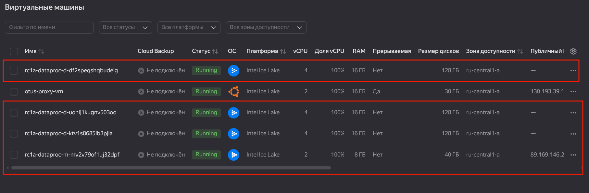
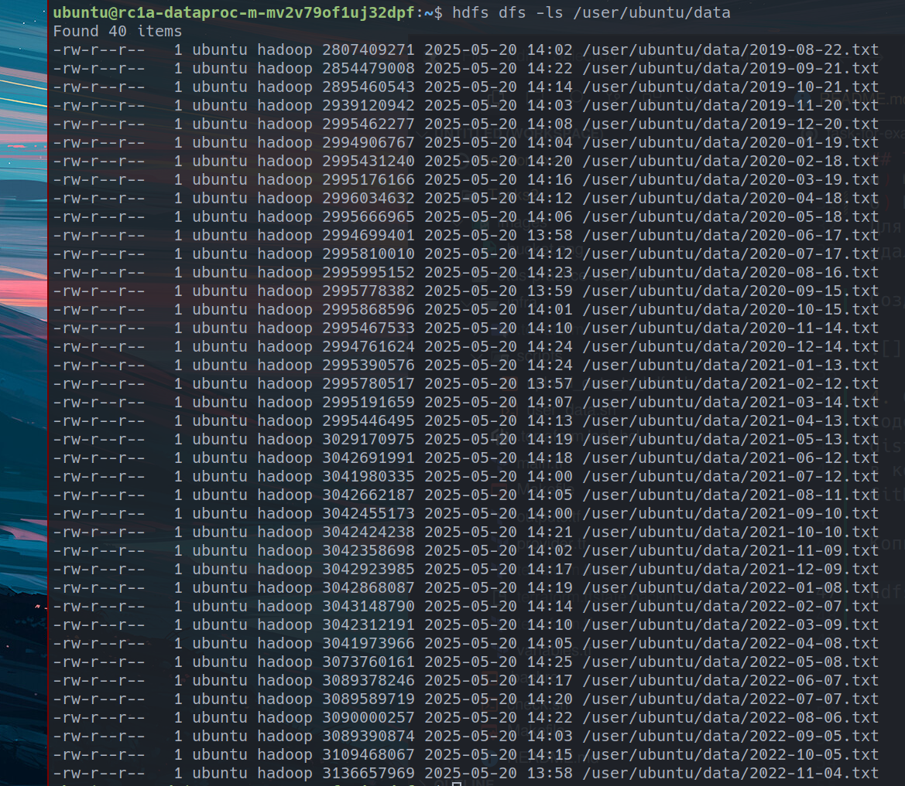
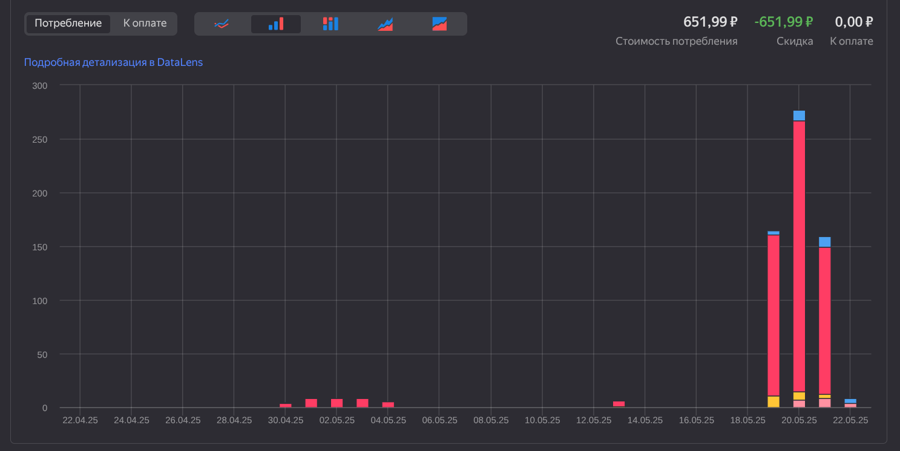
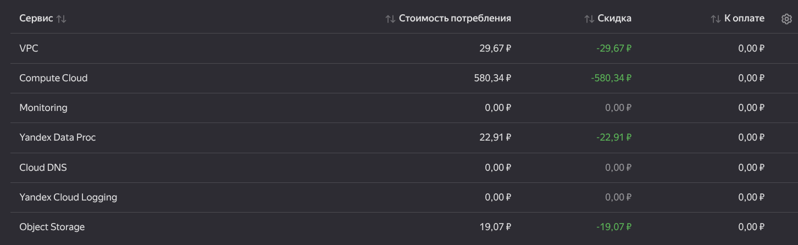

## Task 2

Для выполнения задач использовал исходники с https://github.com/NickOsipov/otus-practice-cloud-infra/tree/main/infra

## Задача 1
1. Создать новый backet в Yandex Cloud Object Storage с использованием terraform скрипта. Выложить созданный вами скрипт в github репозиторий c заданием.

Бакет создается через https://github.com/DarVeter24/mlopstraining/blob/main/Tasks2/otus-practice-cloud-infra/infra/main.tf

---

## Задача 2
2. Скопировать в него содержимое предоставленного Вам хранилища с
использованием инструмента s3cmd.

Копирование также осуществлялось за счет скрипта user_data.sh, в котором сделано небольшое изменение, поменяли копирование одного файла на все.

https://github.com/DarVeter24/mlopstraining/blob/main/Tasks2/otus-practice-cloud-infra/infra/scripts/user_data.sh

Посмотреть можно

`s3cmd ls s3://otus-bucket-b1g51smi0tng33t5hkg9`

`https://storage.yandexcloud.net/otus-bucket-b1g51smi0tng33t5hkg9`

---

## Задача 3

3. Создать Spark-кластер в Data Proc с двумя подкластерами со следующими
характеристиками:
а) Мастер-подкластер: класс хоста s3-c2-m8, размер хранилища 40 ГБ.
б) Data-подкластер: класс хоста s3-c4-m16, 3 хоста, размер хранилища 128 ГБ.
Для экономии ресурсов необходимо использовать terraform скрипт для создания и
удаления кластера.

### Создан мастер s3-c2-m8 и 3 хоста s3-c4-m16

---

## Задача 4

4. Соединиться по SSH с мастер-узлом и выполнить на нём команду копирования
содержимого хранилища в файловую систему HDFS с использованием инструмента hadoop
distcp. Для проверки преподавателем необходимо вывести содержимое HDFS-директории
в консоль, а снимок экрана с этой информацией привести в README-файле Вашего
GitHub-репозитория.

Копирование осуществлялость автоматом, за счет запуска скрипта upload_data_to_hdfs.sh

hdfs dfs -ls /user/ubuntu/data

Содержимое системы

---

## Задача 5

5. Пользуясь тарифным калькулятором Yandex Cloud, оценить месячные затраты для
поддержания работоспособности созданного кластера. Оценить, насколько использование
HDFS-хранилища дороже, чем объектного. Указание. Кроме тарифного калькулятора, позволяющего делать оценку требуемых средств, на странице платежного аккаунта есть раздел с детализацией биллинга за произвольный период времени. С его помощью можно определить сумму уже потраченных средств на каждый из используемых облачных сервисов в процессе работы.

5.1 Оценка месяцных затрат на кластер вообщем
- 5.1.1 По оценки тарифного калькулятора Yandex Cloud

### **Общая сумма: 32 143,52 ₽ вмесяц**

1 603,15 (Proxy VM) + 27 964,80 (DataProc) + 2 575,57 (Object Storage)= 32 143,52 ₽ вмесяц

### Вывод:

- Основная доля затрат — **кластер DataProc** (~87% бюджета)
- Есть затраты на **исходящий трафик из Object Storage**
- **Proxy VM** — можно уменьшить, если использовать её только по расписанию
    
## Детализация

### Proxy vm для удаленной работы
1 603,15 ₽ в месяц

Intel Ice Lake. 100% vCPU — прерываемые ВМ
451,01 ₽
Публичный IP-адрес
186,62 ₽
Intel Ice Lake. RAM — прерываемые ВМ
870,91 ₽
Стандартное сетевое хранилище (HDD)
94,61 ₽

### Кластер Yandex Data Processing
27964,80 ₽ вмесяц
38,84 ₽ в час

Intel Ice Lake. 100% vCPU
15,88 ₽
Yandex Data Proc - Intel Ice Lake. 100% vCPU
1,81 ₽
Intel Ice Lake. RAM
16,93 ₽
Yandex Data Proc - Intel Ice Lake. RAM
1,81 ₽
Стандартное сетевое хранилище (HDD)
1,68 ₽
Быстрое сетевое хранилище (SSD)
0,71 ₽

### Object Storage
2 575,57 ₽ вмесяц

Хранилище Object Storage 500Gb
1 088,41 ₽
Занятое место в стандартном хранилище
1 083,22 ₽
Стандартное хранилище — операции GET 100000
0,00 ₽
Стандартное хранилище — операции POST 20000
5,18 ₽
Исходящий трафик из Object Storage в интернет 1000Gb
1 487,16 ₽

### 5.1.2 Оценить сумму потраченных средств на каждый из используемых облачных сервисов в процессе работы.

Общая сумма составляет 651,99 ₽
Наибольшие застраты приходятся на виртуалку

### 5.2 Оценить, насколько использование HDFS-хранилища дороже, чем объектного

Использование HDFS (в составе DataProc) обходится примерно в 10,85 раз дороже, чем использование Object Storage, если сравнивать полную стоимость кластера со всеми операциями, хранилищем и трафиком.

---

## Задача 6

6. Предложить способы для оптимизации затрат на содержание Spark-кластера в облаке

### Разделение хранилища и вычислений

### **1. Временное удаление/создание кластера по расписанию**
**(Обернуть `terraform apply/destroy` в GitLab CI, Airflow DAG или cron)**

- Экономия: **~70–80%**, если кластер используется не 24/7
- Используется при проектной или периодической нагрузке
- Добавить автоматическую проверку: «нет активных заданий — уничтожить кластер»
    
### **2. Использование авто-масштабирования (autoscaling) кластера**
- Экономия: **~50–70%** при переменной нагрузке
- Указывать `initial_node_count = 1`, `max_hosts_count = N`
- Настраивать по метрикам CPU и памяти
    
### **3. Хранить сырые данные и артефакты в Object Storage (`s3a://`)**
- Вместо HDFS — использовать дешёвое и надёжное объектное хранилище
- Позволяет **удалить кластер без потери данных**
- **Снижение расходов на хранение ~5–10×**

### **4. Использовать прерываемые (preemptible) ВМ в DataProc**
- Указывать в Terraform: `preemptible = true` 
- Подходят для батч-задач и обучения моделей 
- **Снижение расходов на VM ~60–80%**

### **5. Использовать локальные диски (`tmpfs`, `local-ssd`) для временных данных и shuffle**
- Уменьшает зависимость от HDFS или сетевого диска  
- Увеличивает скорость и снижает затраты

### **6. Профилирование задач и отказ от избыточных ресурсов**
- Использовать Spark UI/History Server для анализа использования CPU/памяти 
- Уменьшить `executor.memory`, `executor.cores`, если ресурсы простаивают
    
### **7. Объединение малых заданий (job coalescing)**
- Если pipeline разбит на много мелких DAG'ов — объединить их в одно Spark-приложение
- Меньше overhead — меньше запусков кластеров

---

## Задача 7

7. В соответствии с достигнутыми результатами, изменить статус ранее созданных
задач на Kanban-доске в GitHub Projects. Возможно, некоторые задачи нужно будет
скорректировать, разделить на подзадачи или объединить друг с другом.

https://github.com/users/DarVeter24/projects/2

Распределил подзадачи в основные групп

Безопасное хранение данных
https://github.com/DarVeter24/mlopstraining/issues/3

Создание инфраструктуры
https://github.com/DarVeter24/mlopstraining/issues/8