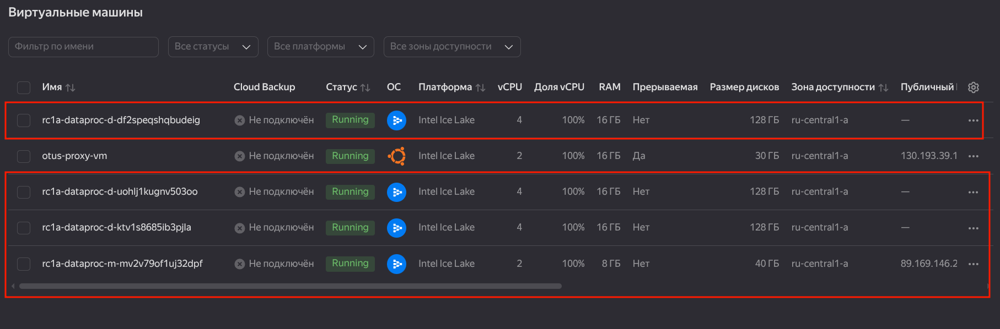
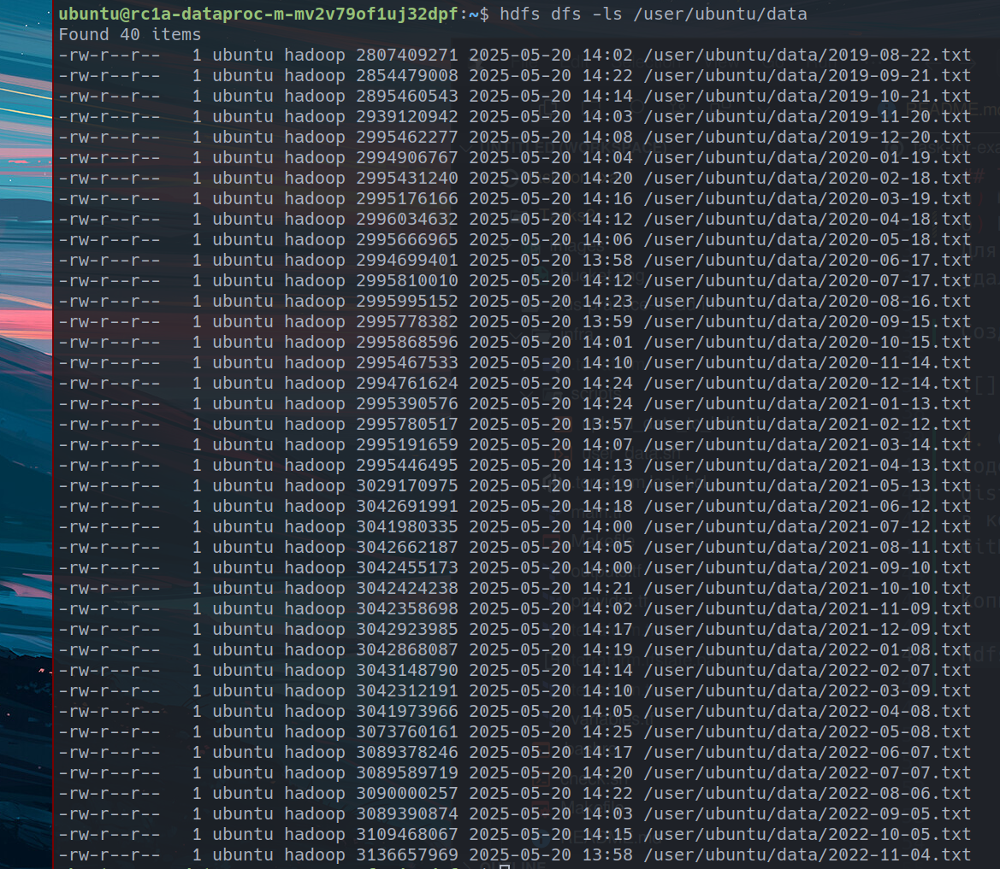

Для выполнения задач использовал исходники с https://github.com/NickOsipov/otus-practice-cloud-infra/tree/main/infra

## Task 2

1. Создать новый backet в Yandex Cloud Object Storage с использованием terraform скрипта. Выложить созданный вами скрипт в github репозиторий c заданием.

Бакет создается через https://github.com/DarVeter24/mlopstraining/blob/main/Tasks2/otus-practice-cloud-infra/infra/main.tf

2. Скопировать в него содержимое предоставленного Вам хранилища с
использованием инструмента s3cmd.

Копирование также осуществлялось за счет скрипта user_data.sh, в котором сделано небольшое изменение, поменяли копирование одного файла на все.

https://github.com/DarVeter24/mlopstraining/blob/main/Tasks2/otus-practice-cloud-infra/infra/scripts/user_data.sh

Посмотреть можно

`s3cmd ls s3://otus-bucket-b1g51smi0tng33t5hkg9`

`https://storage.yandexcloud.net/otus-bucket-b1g51smi0tng33t5hkg9`

3. Создать Spark-кластер в Data Proc с двумя подкластерами со следующими
характеристиками:
а) Мастер-подкластер: класс хоста s3-c2-m8, размер хранилища 40 ГБ.
б) Data-подкластер: класс хоста s3-c4-m16, 3 хоста, размер хранилища 128 ГБ.
Для экономии ресурсов необходимо использовать terraform скрипт для создания и
удаления кластера.

Создан мастер s3-c2-m8 3 хоста s3-c4-m16

4. Соединиться по SSH с мастер-узлом и выполнить на нём команду копирования
содержимого хранилища в файловую систему HDFS с использованием инструмента hadoop
distcp. Для проверки преподавателем необходимо вывести содержимое HDFS-директории
в консоль, а снимок экрана с этой информацией привести в README-файле Вашего
GitHub-репозитория.

Копирование осуществлялость автоматом, за счет запуска скрипта upload_data_to_hdfs.sh

hdfs dfs -ls /user/ubuntu/data

Содержимое системы

