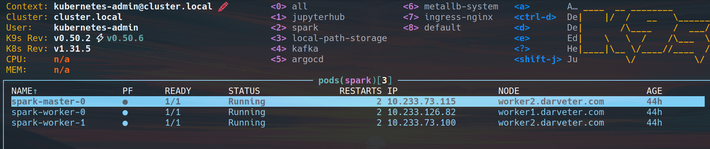

## Введение

Так как я уже разворачивал ранее Spark-кластер в Data Proc, решил проделать это на барметале с точки зрения инфрастуктуры и кластера кубера. Думаю на конечный результат домашки не влияет, так как это рабочий скрипт который можно запускать с любой точки (Jupyter Notebook с PySpark, Airflow, CronJob, GitLab CI и т.д.)

## Текущая архитектура на барметале имеет Кластерный режим.
Драйвер стартует на pod-е JupyterHub, но исполнители (executors) запускаются на других pod-ах Spark Worker в кластере и они могут масштабироваться. Ресурсы — суммарные ресурсы воркеров, под контролем Kubernetes и лимитов чарта. Данные — можно забирать с S3/MinIO, HDFS, NFS и т.п., если правильно настроены jar и endpoint'ы. У меня забираются с MinIO.

## Этапы:
1) Залил датасет в minio из яндекс бакета. Минио у меня стоит отдельно на виртуалке.
2) Развернул jupyter notebook как полноценный сервис в виде jupyterhub в кубере, через argocd.
Пришлось правда модифициовать дефолтный volumes, там подменил jupyter-base-notebook:5.3.0-debian-12-r6 на свой. Добавил в него openjdk-17-jdk-headless, pyspark==3.5.5, для корректной работы и совместимости версий.
jupyterhub - https://artifacthub.io/packages/helm/bitnami/jupyterhub
3) Также раскатал в кубер spark
4) Cкрипт запускаю с точки из Jupyter Notebook, и данные обмениваются между Jupyter-нодой (где работает Spark Driver) и Spark Cluster (Master + Executors). Vscode без проблем коннектится к серсису jupyterhub c Jupyter Notebook просто по ссылке по логину и паролю или токену, так как это сервис который машртутизирует nginx ingress.

## Немного скринов из развернутой инфрастуктуре

### Spark
k8s

UI spark

### Juptyer
k8s

UI jupyterhub

### Vscode

## Задачи по домашке

5. На основе проведенного анализа качества создать скрипт, который должен
выполнять очистку данных с использованием Apache Spark. Скрипт должен иметь
возможность автоматического запуска внешней системой.

Текущий скрипт можно запускать из любой точки, предварительно его обернув в нужный формат
PythonOperator, BashOperator или SparkSubmitOperator для Apache Airflow и т.д.

[Файл clear-dataset.ipynb](minio-kuber-spark/clear-dataset.ipynb)

6. Выполнить очистку датасета с использованием созданного скрипта и сохранить
его в созданном выше bucket’е в формате parquet, подходящем для хранения большого
объема структурированных данных.

### Данные скрипт почистил но как-то не особо качественно думаю

Схема датафрейма:
root
 |-- # tranaction_id | tx_datetime | customer_id | terminal_id | tx_amount | tx_time_seconds | tx_time_days | tx_fraud | tx_fraud_scenario: integer (nullable = true)

- Строк до очистки : 1879794138
- Строк после dropna: 1879794138
- Строк после фильтра выбросов: 1879794138
- Строк после логических фильтров: 1879794138

Новые значения

DropNA: 1879794138 → 1879753826
После выбросов: 1757576184 строк
Логические фильтры: 1757576184 → 1471325

Посмотреть можно в папке clean

`s3cmd ls --recursive s3://otus-bucket-b1g51smi0tng33t5hkg9/clean/`

`https://storage.yandexcloud.net/otus-bucket-b1g51smi0tng33t5hkg9`

7. В соответствии с достигнутыми результатами, изменить статус ранее созданных
задач на Kanban-доске в GitHub Projects. Возможно, некоторые задачи нужно будет
скорректировать, разделить на подзадачи или объединить друг с другом.

Добавил очистку данных с использованием Apache Spark

https://github.com/users/DarVeter24/projects/2

