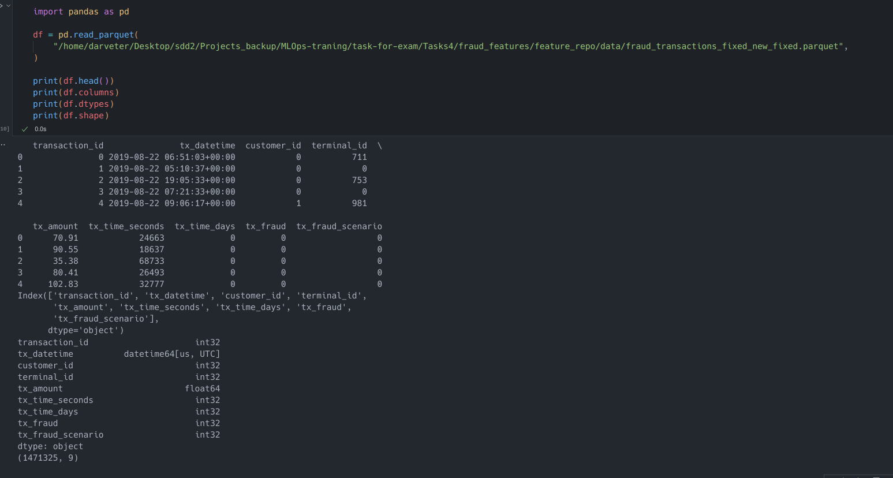

Цель — получить опыт работы с Feast, попрактиковаться в создании Feature View.

Описание/Пошаговая инструкция выполнения домашнего задания:
1) Создайте 2 новые feature View
2) Создайте 1 on-demand feature view

Выполнил 1 и 2 пункт 

3) Приложите ноутбук, в котором делаете запрос к этим Feature View.

- [Файл ноутбук example_repo.py](./fraud_features/feature_repo/example_repo.py)
- [Файл ноутбук feast-data.ipynb](./feast-data.ipynb)

