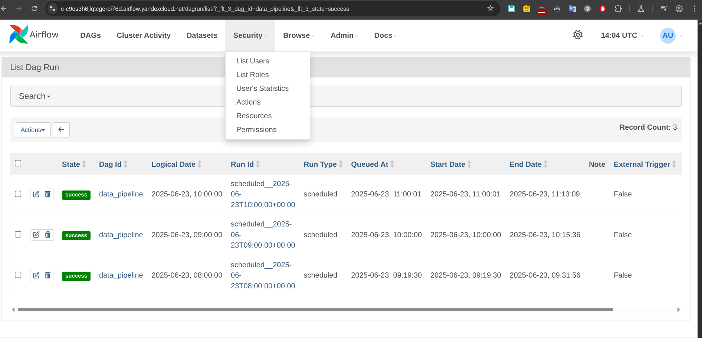

Цели:

1. Запустить систему Apache Airflow на отдельной виртуальной машине Yandex
cloud.

В main file внес небольшое изменение на будещее, чтобы автоматом подставлялся в env переменная AIRFLOW_HOST, это url airflow, для возможности доступа по ssh и т.д. может понадобиться.

- [Main file](./my-practice-airflow-yandex-cloud/infra/main.tf)

1. Создать DAG для ежедневного автоматизированного создания и удаления Sparkкластера и запуска скрипта очистки датасета и разместить его в директории для DAG’ов,
доступной Apache Spark. В графе следует прописать этапы копирования скрипта и
необходимых ему файлов на Spark-кластер, а также его запуска на кластере посредством
spark-submit.

В даге ничего не делал только осознал, большая благодарность за Ваш труд:)

- [Dag data_pipeline.py](./my-practice-airflow-yandex-cloud/dags/data_pipeline.py)

pyspark_script.py подменил своим файлом, датасет состоит из парочки файлов txt, чтобы не ждать выполения обработки всего датасета.

- [Spark pyspark_script.py](./my-practice-airflow-yandex-cloud/src/pyspark_script.py)
- [Src папка](./my-practice-airflow-yandex-cloud/data)

3. Убедиться, что граф загрузился в систему и отображается в графическом
интерфейсе. Файл(-ы) с DAG необходимо разместить в Вашем GitHub- репозитории и
предоставить для проверки

4. Разрешить периодическое исполнение разработанного DAG в Apache AirFlow и
протестировать его работоспособность. Требуется дождаться не менее трёх успешных
запусков процедуры очистки датасета по расписанию. Снимок экрана, подтверждающий
успешную работу системы, необходимо привести в README-файле Вашего GitHubрепозитория.

Загрузка в бакет

Детали
`s3cmd ls --recursive s3://airflow-bucket-83c47db0a5c45b4f/`

5. В соответствии с достигнутыми результатами, изменить статус ранее созданных
задач на Kanban-доске в GitHub Projects. Возможно, некоторые задачи нужно будет
скорректировать, разделить на подзадачи или объединить друг с другом.

