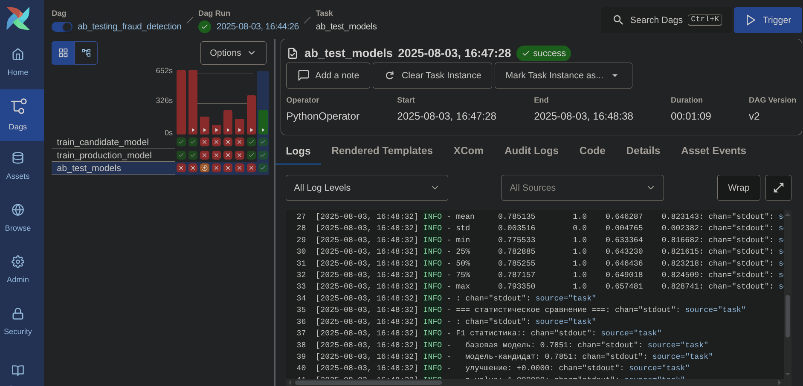
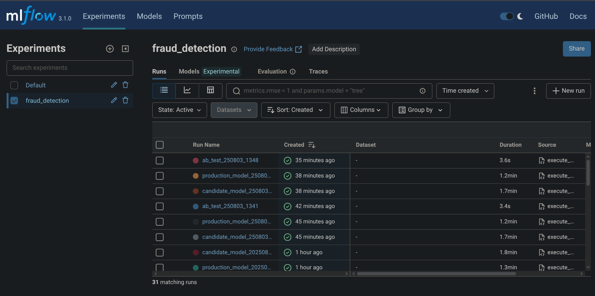
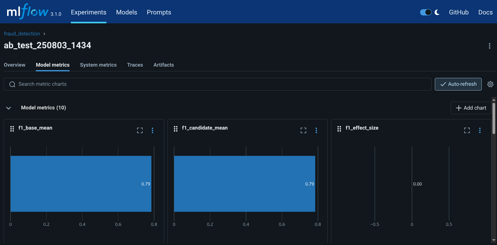
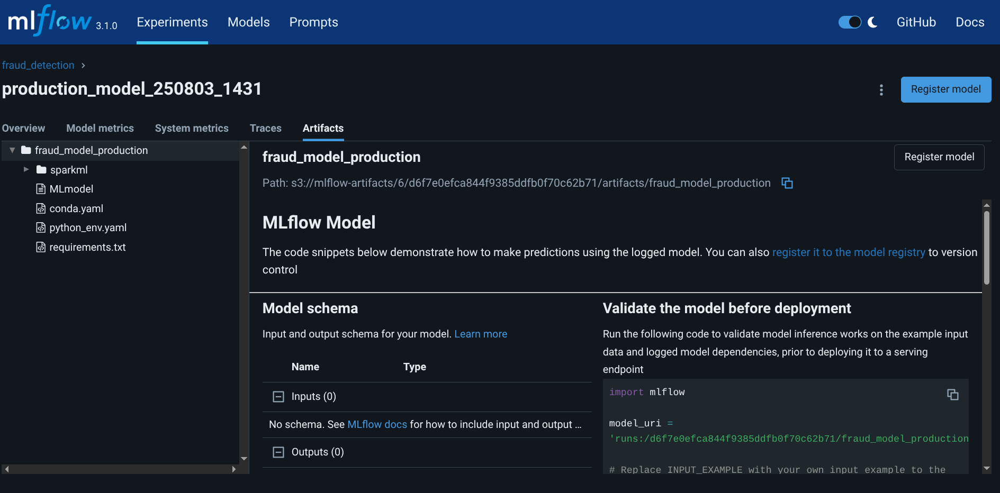

# A/B тестирование модели обнаружения мошенничества с валидацией стратегий

**Домашнее задание №7**  
**Курс MLOps**  
**Образовательная платформа «Otus»**

## Цель работы

Выбрать стратегию для валидации модели и создать код для проведения A/B теста с оценкой метрик модели на выбранной стратегии. Адаптировать существующий пайплайн обучения для внедрения A/B тестирования с использованием статистических методов валидации.

## ⚡ Особенность реализации

**Вместо облачной среды Yandex Cloud использовалось bare metal решение на базе Proxmox:**
- **Гипервизор:** Proxmox VE для управления виртуальными машинами
- **Kubernetes кластер** развернут на ВМ в Proxmox на физических серверах
- **MinIO** как S3-совместимое хранилище развернуто локально в кластере
- **PostgreSQL** для MLflow развернута в кластере
- Все компоненты работают на собственной инфраструктуре без использования управляемых облачных сервисов

**Airflow DAG с A/B тестированием:**



*Успешное выполнение DAG с параллельным обучением двух моделей и последующим A/B тестированием*

**Список экспериментов в MLflow:**



*MLflow интерфейс показывает все прогоны: базовые модели, модели-кандидаты и результаты A/B тестов*

**Детальные метрики A/B теста:**



*Подробные статистические метрики A/B теста: p-values, effect size, улучшения по каждой метрике*

**Артефакты production модели:**



*Сохраненные артефакты базовой модели в MLflow: Spark pipeline, параметры, метрики*


## Выполненные задания

### 1. Выбор стратегии валидации модели

**🎯 Выбранная стратегия:** A/B тестирование с двумя критериями валидации:
- **Критерий 1:** Статистическая значимость (p-value < 0.01)
- **Критерий 2:** Положительное улучшение метрики F1-score

**Обоснование выбора:**
- Bootstrap анализ для оценки стабильности метрик
- t-test для определения статистической значимости различий
- Cohen's d для измерения размера эффекта


### 2. Создание A/B тестирования модели

**Основные файлы:**
- [ab_testing_fraud_pipeline.py](./dags/ab_testing_fraud_pipeline.py) - DAG с A/B тестированием

**Ключевые функции:**
- `bootstrap_metrics_spark()` - bootstrap анализ метрик (100 итераций)
- `statistical_comparison_fraud()` - статистическое сравнение моделей
- `train_production_model()` - обучение базовой модели
- `train_candidate_model()` - обучение модели-кандидата

```python
# Логика принятия решения
f1_significant = f1_results.get('is_significant', False)  # p < 0.01
f1_improvement = f1_results.get('improvement', 0) > 0    # F1 улучшился
should_deploy = f1_significant and f1_improvement        # ОБА критерия
```

### 3. Реализация статистических методов
**Bootstrap анализ:**
- 100 итераций resampling для каждой модели
- Вычисление F1, Precision, Recall, AUC для каждой итерации
- Построение доверительных интервалов

**Статистическое сравнение:**
- t-test для проверки значимости различий
- Размер эффекта (Cohen's d)
- Двукритериальная валидация

### 4. Результаты A/B тестирования

**Успешно выполненный A/B тест:**

```
=== ИТОГОВОЕ РЕШЕНИЕ ПО A/B ТЕСТУ ===
✅ Критерий 1 - статистическая значимость (α=0.01): False
✅ Критерий 2 - положительное улучшение F1: False
⛔ Решение: оставить текущую модель в production
   Причина: модель-кандидат не показала улучшения F1
```


**Метрики моделей:**
- **Базовая модель:** F1=0.785, AUC=0.857, Accuracy=0.989
- **Модель-кандидат:** F1=0.785, AUC=0.996, Accuracy=0.989

**Статистический анализ:**
- t-статистика: 0.0 (модели идентичны)
- p-value: 1.0 (нет значимости)
- Решение: не деплоить (2 критерия не выполнены)


## Ключевые достижения

1. ✅ **Выбрана стратегия валидации модели:** A/B тестирование с двумя критериями
2. ✅ **Создан код A/B тестирования:** Адаптирован из существующих компонентов
3. ✅ **Реализована статистическая валидация:** Bootstrap + t-test + Cohen's d
4. ✅ **Интегрировано с Airflow:** DAG с параллельным обучением моделей
5. ✅ **Проведено успешное тестирование:** Корректное принятие решений

**🎯 Двукритериальная система валидации:**
- **Критерий 1:** Статистическая значимость (α=0.01)
- **Критерий 2:** Положительное улучшение F1-score
- **Решение:** Деплой только при выполнении ОБОИХ критериев

**📊 Результаты тестирования:**
- A/B тест выполнен корректно
- Модели обучены на одинаковых данных (честное сравнение)
- Статистический анализ показал отсутствие значимых различий

---

**💪 Заключение:** Создана полноценная система A/B тестирования моделей машинного обучения с статистической валидацией, интегрированная с MLOps пайплайном на базе bare metal инфраструктуры Proxmox VE. 


## Использованные технологии

- **Apache Airflow** - оркестрация ML пайплайнов и A/B тестирования
- **MLflow** - отслеживание экспериментов и управление моделями
- **PySpark** - обработка данных и машинное обучение
- **SciPy** - статистические тесты (t-test)
- **NumPy** - численные вычисления
- **Pandas** - манипуляции с данными
- **scikit-learn** - метрики качества моделей
- **MinIO** - S3-совместимое хранилище артефактов
- **Kubernetes** - контейнерная оркестрация

## 🏗️ Архитектурные особенности Bare Metal решения на Proxmox VE

**Отличия от требований задания (Yandex Cloud):**

| Компонент | Требование (Yandex Cloud) | Реализация (Bare Metal + Proxmox VE) |
|-----------|---------------------------|---------------------------------------|
| **Airflow** | Managed Service for Apache Airflow | Самостоятельное развертывание в K8s кластере |
| **MLflow** | Отдельная виртуальная машина | Pod в Kubernetes кластере |
| **База данных** | Managed Service for PostgreSQL/MySQL | PostgreSQL в контейнере на отдельной vm в не кластера k8s |
| **Object Storage** | Yandex Object Storage | MinIO в K8s кластере |
| **Spark кластер** | Облачный Spark-кластер | PySpark в Airflow задачах |
| **Инфраструктура** | Облачные ресурсы | ВМ на Proxmox VE (физические серверы) |
| **Гипервизор** | Отсутствует (облачная абстракция) | **Proxmox VE** |
