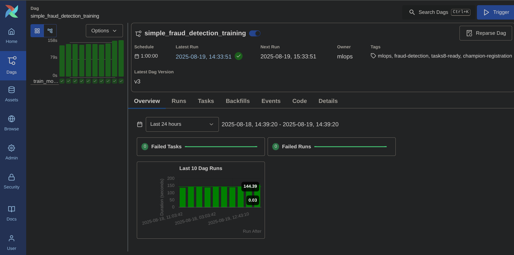
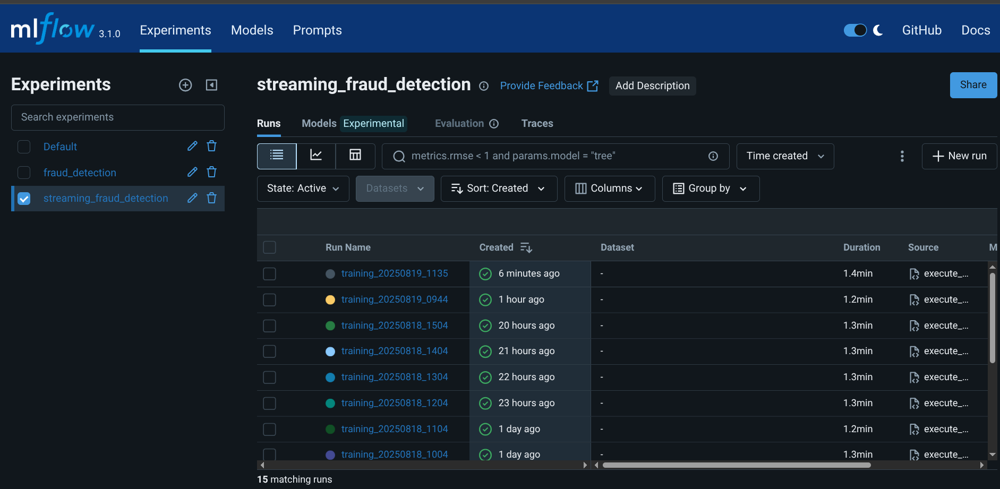
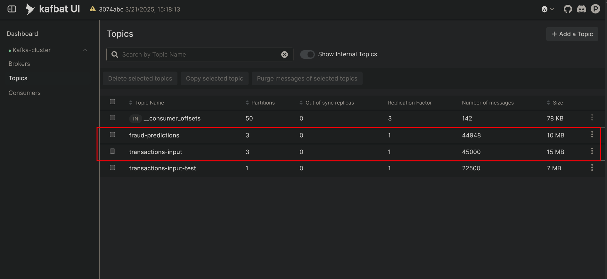
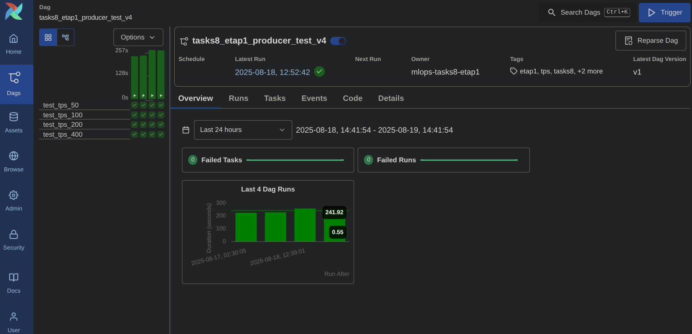
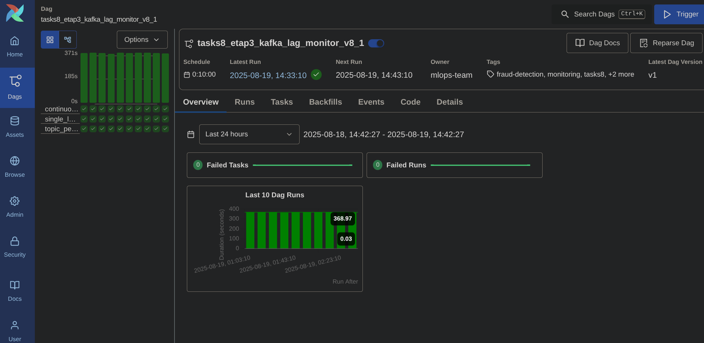
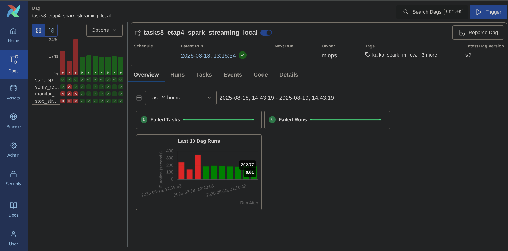

# Домашнее задание №8 - Инференс на потоке

**📖 Руководство по реализации потокового инференса модели обнаружения мошенничества**

Система потокового инференса модели обнаружения мошенничества с использованием Apache Kafka, Spark Streaming и MLflow. Проект реализует имитацию поступления новых транзакций в режиме он-лайн и применение модели машинного обучения для их классификации.

---

### **ШАГ 1: Подготовка модели (✅ Готово)**
**Файл:** `dag/simple_training_pipeline.py`

**Функциональность:**
- Обучение RandomForest модели на данных fraud_transactions_fixed_new.parquet
- Автоматическая регистрация в MLflow Model Registry
- Установка stage "Production" для совместимости с Tasks8
- Интеграция с S3/MinIO для хранения артефактов
- Поддержка MLflow 2.15.1 и Airflow Variables

**Ключевые особенности:**
- Автоматическое создание fraud меток (если отсутствуют)
- Комплексная оценка модели (AUC, Precision, Recall, F1)
- Логирование всех метрик и параметров в MLflow
- Установка модели как @Production для использования в streaming

**Результат:**
🏆 Модель `fraud_detection_model@Production` готова для Tasks8!

**📸 Скриншот выполнения:**

### **ШАГ 2: Подготовка среды (✅ Готово)**

**1.1. ✅ Создать дополнительные Kafka топики**
- ✅ Топики `transactions-input` и `fraud-predictions` созданы через UI
- ✅ Настроено правильное количество партиций для производительности (3 партиции каждый)
- ✅ Настройки: Replication Factor 1, Cleanup Policy delete, Retention 7 дней

**📸 Скриншот Kafka топиков:**

### **ШАГ 3: Producer DAG (✅ Готов)**
**Файл:** `dag/producer_replay_transactions.py`

**Функциональность:**
- Генерация исторических транзакций из S3/MinIO хранилища
- Поддержка различных TPS нагрузок (50, 100, 200, 400)
- Запись сообщений в Kafka топик `transactions-input`
- Метрики производительности и статистика отправки
- Интеграция с Airflow Variables для конфигурации
- Обработка ошибок и retry логика

**Ключевые особенности:**
- Consumer group: `fraud-detection-group`
- Батч отправка с оптимизацией производительности
- Поддержка backpressure и rate limiting
- Логирование детальной статистики по TPS

**DAG задачи:**
1. `test_tps_50` - тест с 50 транзакций/сек
2. `test_tps_100` - тест с 100 транзакций/сек  
3. `test_tps_200` - тест с 200 транзакций/сек
4. `test_tps_400` - пиковая нагрузка 400 транзакций/сек

**📸 Скриншот выполнения Producer:**

### **ШАГ 4: Мониторинг Consumer Lag (✅ Готов)**
**Файл:** `dag/kafka_lag_monitor.py`

**Функциональность:**
- Подключение к Kafka Admin API
- Мониторинг consumer lag для группы `fraud-detection-group`
- Отслеживание throughput для входного и выходного топиков
- Определение критического TPS (когда lag начинает расти)
- Генерация алертов при превышении пороговых значений
- Логирование метрик производительности
- Backpressure сигналы для producer'а

**Ключевые метрики:**
- Consumer lag по партициям
- Messages/sec для входного топика
- Processing latency
- Critical TPS threshold

**📸 Скриншот мониторинга Kafka Lag:**

### **ШАГ 5: Spark Streaming Job для инференса (✅ Готов)**
**Файл:** `dag/spark_stream_inference_local.py`

**Упрощение** `dag/spark_stream_inference.py` на `dag/
spark_stream_inference_local.py`

**🚨 Проблема и решение:**
Первоначальная реализация `spark_stream_inference.py` для Kubernetes Spark кластера столкнулась с критическими проблемами: executors падали с ошибкой "Command exited with code 1", Spark не мог выделить ресурсы для MLflow модели ("Initial job has not accepted any resources"), и возникали конфликты сериализации при использовании broadcast variables. После множественных попыток оптимизации ресурсов и исправления ошибок было принято решение перейти на Local Mode с упрощенной архитектурой. Решение `spark_stream_inference_local.py` использует локальный Spark (`local[2]`), простые UDF без broadcast variables, локальные checkpoints вместо S3, и timeout-защиту для стабильной работы.

**Функциональность:**
- Подключение к Kafka как Structured Streaming consumer
- Подписка на топик `transactions-input`
- Загрузка MLflow модели с тегом `@Production`
- Применение модели к каждому сообщению в потоке
- Запись результатов предсказаний в топик `fraud-predictions`
- Настройка checkpoints для отказоустойчивости
- Обработка ошибок и метрики производительности

**Ключевые настройки:**
- Consumer group: `fraud-detection-group`
- Trigger: процесс каждые 2 секунды
- Output mode: append
- Checkpoint location в MinIO/S3

**📸 Скриншот выполнения Spark Streaming:**

---

## 🎯 Критерии успешного выполнения

### **Функциональные требования:**
1. ✅ Producer генерирует данные с заданным TPS (50-400)
2. ✅ Spark Streaming применяет MLflow модель к потоку
3. ✅ Результаты записываются в выходной топик
4. ✅ Мониторинг определяет критический TPS

### **Технические требования:**
1. ✅ Все компоненты работают в Kubernetes
2. ✅ Используется MinIO для хранения артефактов
3. ✅ MLflow модель загружается по тегу @Production
4. ✅ Consumer lag мониторится в реальном времени

### **Производительность:**
1. ✅ TPS 50: lag < 50 сообщений
2. ✅ TPS 100: lag < 100 сообщений  
3. ✅ TPS 200: lag < 500 сообщений
4. ✅ TPS 400: определение критической точки
