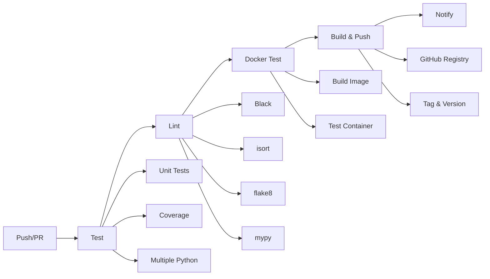

# CI/CD Pipeline Documentation

## Обзор

Этот документ описывает CI/CD pipeline для проекта Fraud Detection API, построенный на GitHub Actions.

## Архитектура Pipeline

### 📋 Основные этапы



## Workflows

### 1. 🚀 Main CI/CD Pipeline (`.github/workflows/ci-cd.yml`)

**Триггеры:**
- Push в ветки `main`, `develop`
- Pull Request в ветку `main`
- Ручной запуск (`workflow_dispatch`)

**Этапы:**

#### **Test Job**
- **Matrix Strategy:** Python 3.11, 3.12, 3.13
- **Кэширование:** pip dependencies
- **Тесты:** pytest с coverage
- **Покрытие:** Codecov integration

```yaml
strategy:
  matrix:
    python-version: ["3.11", "3.12", "3.13"]
```

#### **Lint Job**
- **Форматирование:** Black
- **Сортировка импортов:** isort
- **Линтинг:** flake8
- **Типизация:** mypy

#### **Docker Test Job**
- **Сборка:** Multi-stage Docker build
- **Тестирование:** API endpoints в контейнере
- **Кэширование:** GitHub Actions cache

#### **Build & Push Job** (только для `main`)
- **Registry:** GitHub Container Registry (ghcr.io)
- **Теги:** branch, SHA, latest
- **Метаданные:** build info, git SHA

### 2. 🔒 Security Pipeline (`.github/workflows/security.yml`)

**Триггеры:**
- Push в ветки `main`, `develop`
- Pull Request в ветку `main`
- Schedule: каждый понедельник в 02:00 UTC

**Сканирования:**
- **Safety:** уязвимости в зависимостях
- **Bandit:** security linting
- **Trivy:** Docker image vulnerabilities
- **CodeQL:** статический анализ кода

## Конфигурация

### 📝 Файлы конфигурации

#### `pytest.ini`
```ini
[tool:pytest]
testpaths = tests
addopts = -v --cov=src --cov-report=xml
markers = unit, integration, slow, api
```

#### `.flake8`
```ini
[flake8]
max-line-length = 88
extend-ignore = E203,W503,E501,F401
```

#### `pyproject.toml`
- Black configuration
- isort configuration  
- mypy configuration
- Coverage configuration

### 🔧 Environment Variables

#### Required for CI:
- `GITHUB_TOKEN` - автоматически предоставляется GitHub
- Container Registry permissions

#### Optional:
- `CODECOV_TOKEN` - для upload coverage

## Тестирование

### 🧪 Test Structure

```
tests/
├── __init__.py
├── test_config.py      # Configuration tests
└── test_api_simple.py  # API endpoint tests
```

### Coverage Requirements
- **Минимум:** 80% покрытия кода
- **Отчеты:** HTML, XML, terminal
- **Исключения:** tests/, venv/, __pycache__/

### Test Categories
- `unit` - Unit tests
- `integration` - Integration tests
- `api` - API tests
- `slow` - Slow tests

## Docker Integration

### 🐳 Multi-stage Build

```dockerfile
FROM python:3.13-slim as builder
# Install dependencies

FROM python:3.13-slim
# Copy app and run
```

### Container Testing
```bash
# Build test image
docker build -t fraud-detection-api:test .

# Run container tests
docker run -d -p 8000:8000 --name test-container \
  -e ENVIRONMENT=test \
  fraud-detection-api:test

# Test endpoints
curl -f http://localhost:8000/health
curl -f -X POST http://localhost:8000/predict -d '{...}'
```

## Registry & Deployment

### 📦 GitHub Container Registry

**Image naming:**
```
ghcr.io/username/fraud-detection-api:latest
ghcr.io/username/fraud-detection-api:main-<sha>
ghcr.io/username/fraud-detection-api:develop
```

**Permissions:**
- `contents: read` - для checkout
- `packages: write` - для push в registry

### Deployment Artifacts
- `deployment/image-info.env` - информация о build
- Build date, Git SHA, Image tags

## Локальное тестирование

### 🛠️ Makefile Commands

```bash
# Полный CI цикл
make ci-test

# Только тесты
make test
make test-coverage

# Линтинг
make lint
make format

# Security
make security

# Docker
make docker-build
make docker-test
```

### Ручное тестирование CI
```bash
# Установка CI dependencies
make ci-install

# Запуск всех проверок
make ci-test
```

## Мониторинг и Уведомления

### 📊 Metrics
- **Build time:** отслеживание времени сборки
- **Test coverage:** процент покрытия кода
- **Security issues:** количество уязвимостей

### 🔔 Notifications
- **Success:** уведомление об успешном deploy
- **Failure:** детали ошибок в logs
- **Security:** SARIF reports в Security tab

## Troubleshooting

### Частые проблемы

#### 1. Tests failing
```bash
# Локальная проверка
make test-coverage
# Проверка в Docker
make docker-test
```

#### 2. Linting errors
```bash
# Автоисправление
make format
# Проверка
make lint
```

#### 3. Docker build fails
```bash
# Локальная сборка
docker build -t test .
# Проверка логов
docker logs <container>
```

#### 4. Registry push fails
- Проверить permissions
- Проверить GITHUB_TOKEN
- Проверить branch protection rules

### Debug Commands

```bash
# Verbose pytest
pytest -v -s tests/

# Docker debug
docker run -it --rm fraud-detection-api:test /bin/bash

# Flake8 verbose
flake8 --verbose src/
```

## Best Practices

### 🎯 Рекомендации

1. **Tests First:** пишите тесты перед кодом
2. **Small Commits:** маленькие, атомарные коммиты
3. **Branch Protection:** защищайте main ветку
4. **Security Scans:** регулярные security проверки
5. **Cache Usage:** используйте кэширование для ускорения
6. **Matrix Testing:** тестируйте на разных версиях Python
7. **Fail Fast:** останавливайте pipeline при первой ошибке

### 📈 Performance Optimization

- **Parallel Jobs:** параллельное выполнение
- **Caching:** pip, Docker layer cache
- **Conditional Jobs:** skip ненужных jobs
- **Resource Limits:** оптимальное использование ресурсов

## Future Improvements

### 🔮 Планы развития

1. **E2E Testing:** добавить end-to-end тесты
2. **Performance Testing:** load testing
3. **Multi-environment:** staging, production
4. **Auto-versioning:** semantic versioning
5. **Slack Integration:** уведомления в Slack
6. **Quality Gates:** SonarQube integration
