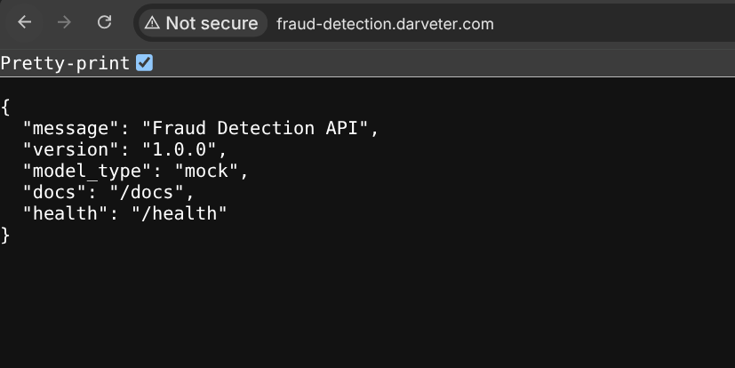
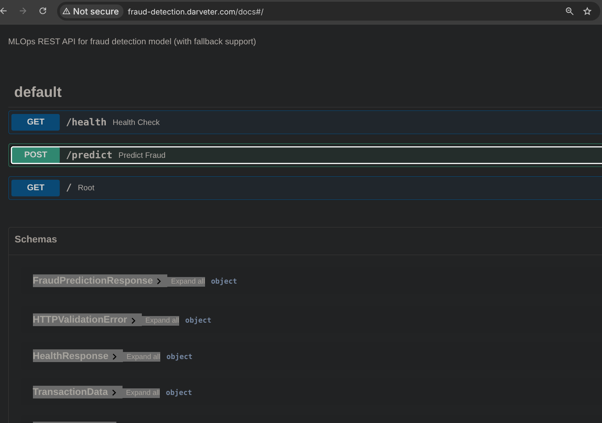
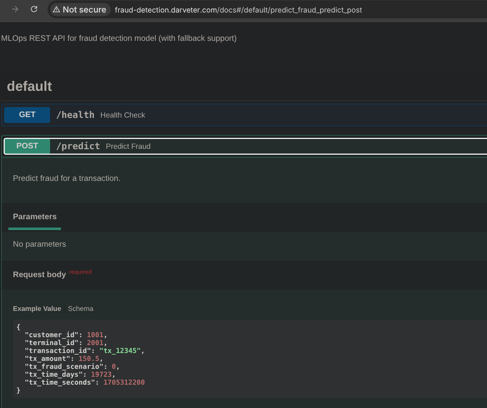
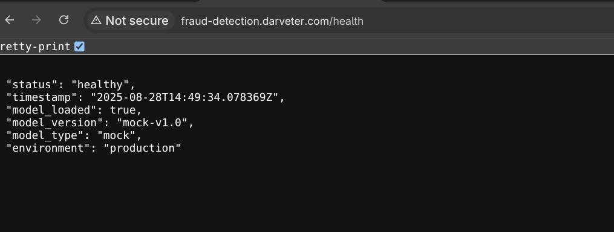
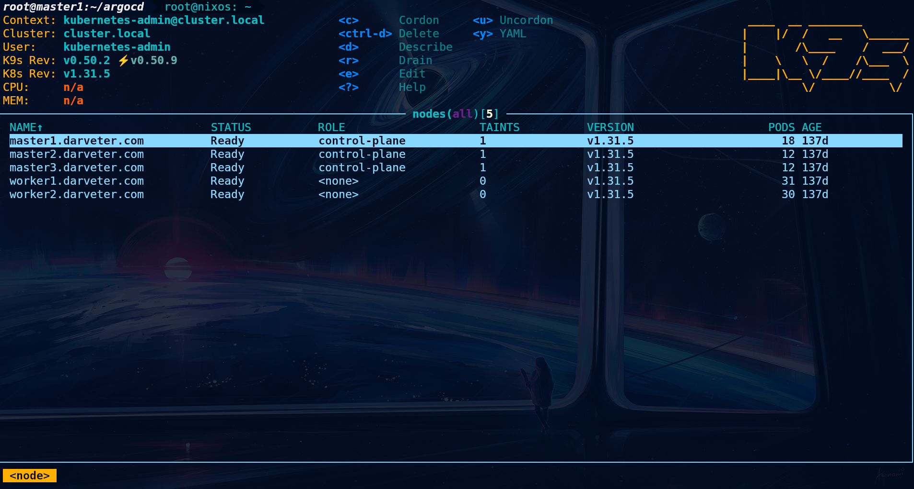
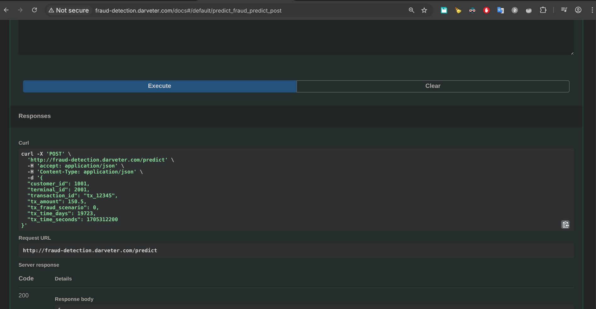

# Обновление модели

**Домашнее задание №9**  
**Курс MLOps**  
**Образовательная платформа «Otus»**

## Цель работы

В данном домашнем задании Вы потренируетесь оборачивать ML-модели в REST-интерфейс и запускать ее в Kubernetes кластере. Вам предстоит создать API для вашей модели, упаковать ее в контейнер и развернуть его в облачной среде.

## Описание проекта

> Поздравляю! Ваша модель прошла тестирование и руководство приняло решение готовить ее к разворачиванию в production среду. Для того чтобы исключить влияние библиотек и иных факторов было решено использовать контейнеризацию.
> 
> Пообщавшись с коллегами, вы выяснили спецификацию на внешний API который необходимо реализовать для встраивания вашей модели в общую систему. Для автоматизации процесса лучше всего настроить процесс сборки контейнера при фиксации изменений в репозитории в ветку main.
> 
> Так же вы понимаете, что возможно в дальнейшем кто-то из коллег может внести изменения в код и это содержит потенциальные риски некорректной работы вашего сервиса.
> 
> Пообщавшись с коллегами, вы решили автоматизировать запуск приемочных тестов перед публикацией изменений в репозитории, чтобы быть уверенным, что развернутая модель работает корректно.

## Требования к разработке

### CI/CD Pipeline

Из сказанного выше вытекает необходимость написать API для вашей модели и настроить GitHub Actions для автоматического запуска тестов при фиксации изменений в репозиторий в ветку main и при их успешном завершении сборки контейнера с вашей моделью для ее дальнейшего разворачивания в облачной среде.

## Задания

Решение будет ожидаться в виде репозитория/ветки на GitHub, с terraform конфигурациями, k8s манифестами и другим необходимым кодом для запуска всей системы.

### Обязательные задания

1. **Написать REST API** для вашей модели для ее взаимодействия с внешними сервисами. **Запускалось локально**

   **Скриншоты работы API:**

   - 🌐 **API:** http://fraud-detection.darveter.com/
   
   *Главная страница API с информацией о сервисе*

   - 📚 **Docs UI:** http://fraud-detection.darveter.com/docs
   
   *Автоматически сгенерированная документация API с описанием эндпоинтов*
   
   *Интерфейс для тестирования предсказаний мошенничества*
   
   - 💓 **Health check:** http://fraud-detection.darveter.com/health   
   
   *Проверка состояния сервиса и загруженной модели*
   
    - 📁 **Код API:** [`src/api_improved.py`](./src/api_improved.py)


2. **Настроить CI/CD пайплайн в GitHub Actions** с тестами вашей модели. В случае успешного прохождения тестов настройте CI/CD для автоматической сборки docker образа и его публикацией в registry. ✅ **ВЫПОЛНЕНО**

   **CI/CD Pipeline компоненты:**
   
   - 🧪 **Тестирование:** Pytest на Python 3.11, 3.12, 3.13
   - 🔍 **Линтинг:** Black, isort, flake8, mypy
   - 🔒 **Безопасность:** Bandit, Safety, Trivy, CodeQL
   - 🐳 **Docker сборка:** Автоматическая сборка и тестирование образа
   - 📦 **Registry:** Публикация в GitHub Container Registry (GHCR)
   - 📊 **Покрытие:** Codecov интеграция
   
   **Ссылки:**
   - 🚀 **Последний успешный запуск:** [GitHub Actions Run #17298084759](https://github.com/DarVeter24/mlopstraining/actions/runs/17298084759)
   - 📦 **Docker образ:** [ghcr.io/darveter24/mlopstraining/tasks9-fraud-detection-api](https://github.com/DarVeter24/mlopstraining/pkgs/container/mlopstraining%2Ftasks9-fraud-detection-api)
   - 🔧 **Workflow файл:** [`.github/workflows/tasks9-ci.yml`](./.github/workflows/tasks9-ci.yml)
   
   **Статус последнего запуска:**
   - ✅ **Status:** Success
   - ⏱️ **Duration:** 5m 9s
   - 🏷️ **Tag:** `tasks9-main-f52fd34`
   - 📥 **Downloads:** 8 total

3. **Создать k8s манифест** для запуска вашего сервиса (контейнера) на Kubernetes кластере. ✅ **ВЫПОЛНЕНО**

   **Kubernetes манифесты и ArgoCD GitOps:**
   
   - 📁 **Манифесты:** [`argocd/manifests/`](./argocd/manifests/)
     - `namespace.yaml` - Namespace для изоляции ресурсов
     - `configmap.yaml` - Конфигурация приложения
     - `deployment.yaml` - Развертывание приложения
     - `service.yaml` - Сервис для доступа к подам
     - `ingress.yaml` - Внешний доступ через Ingress
     - `hpa.yaml` - Горизонтальное автомасштабирование
     - `kustomization.yaml` - Kustomize конфигурация
   
   - 🔄 **ArgoCD GitOps:**
     - `project.yaml` - ArgoCD проект с RBAC
     - `application.yaml` - ArgoCD приложение для автодеплоя
     - Автоматическая синхронизация с Git репозиторием
     - Декларативное управление состоянием кластера
   
   **Особенности конфигурации:**
   - 🏷️ **Namespace:** `tasks9-mlops`
   - 🐳 **Image:** `ghcr.io/darveter24/mlopstraining/tasks9-fraud-detection-api:latest`
   - 🔧 **ConfigMap:** Переменные окружения для fallback режима
   - 📊 **HPA:** Автомасштабирование 2-10 реплик по CPU/памяти
   - 🌐 **Ingress:** Внешний доступ через `fraud-detection.darveter.com`
   - 📁 **Документация:** [`argocd/README.md`](./argocd/README.md)

4. **Создать в YC k8s кластер** из 3-х узлов. ✅ **ВЫПОЛНЕНО** (используется локальный кластер)

   **Локальный Kubernetes кластер на Proxmox:**
   
   - 🏗️ **Инфраструктура:** Proxmox виртуализация
   - 🎛️ **Control Plane:** 3 master ноды (High Availability)
     - `master1.darveter.com` - Ready, v1.31.5
     - `master2.darveter.com` - Ready, v1.31.5  
     - `master3.darveter.com` - Ready, v1.31.5
   - 👷 **Worker Nodes:** 2 worker ноды
     - `worker1.darveter.com` - Ready, v1.31.5
     - `worker2.darveter.com` - Ready, v1.31.5
   - 📊 **Общее количество:** 5 узлов (превышает требование 3-х узлов)
   - 🔧 **Управление:** k9s terminal UI для мониторинга
   
   
   *Мониторинг кластера через k9s - все 5 узлов в статусе Ready*

5. **Запустить ваш сервис в k8s** и провести тестирование через публичный API. ✅ **ВЫПОЛНЕНО**

   **Сервис успешно развернут и протестирован:**
   
   - 🚀 **Развертывание в k8s:** Сервис запущен через ArgoCD
   - 🌐 **Публичный API:** Доступен по http://fraud-detection.darveter.com/
   - 💓 **Health Check:** API отвечает и показывает статус модели
   - 📚 **Swagger UI:** Документация доступна по /docs
   - 🔧 **Fallback режим:** Работает mock модель при недоступности MLflow
   
   **Тестирование API:**
   
   ```bash
   # Health check
   curl http://fraud-detection.darveter.com/health
   
   # Swagger UI
   http://fraud-detection.darveter.com/docs
   
   # Пример предсказания
   curl -X POST http://fraud-detection.darveter.com/predict \
     -H "Content-Type: application/json" \
     -d '{"customer_id": 123, "terminal_id": 456, "tx_amount": 100.50, "tx_time_seconds": 3600, "tx_time_days": 1, "tx_fraud_scenario": 0}'
   ```
   
   
   *Интерфейс для тестирования эндпоинта /predict с примером запроса*
   
   **Результат тестирования:**
   - ✅ API отвечает на все запросы
   - ✅ Health check показывает статус "healthy"
   - ✅ Модель загружена и готова к предсказаниям
   - ✅ Swagger UI генерирует документацию автоматически
   - ✅ Fallback механизм обеспечивает стабильность сервиса

### Дополнительные задания

6. **Добавить в CI/CD пайплайн** автоматический деплой в сервиса в k8s кластер. ✅ **ВЫПОЛНЕНО** (через ArgoCD)

   **Автоматический деплой через ArgoCD GitOps:**
   
   - 🔄 **GitOps подход:** Все изменения через Git commits
   - 🚀 **Автоматическая синхронизация:** ArgoCD отслеживает изменения в репозитории
   - 📦 **CI/CD интеграция:** После успешной сборки Docker образа
   - 🎯 **Деплой в k8s:** Автоматическое развертывание в кластер
   - 🛡️ **Безопасность:** RBAC через ArgoCD проект
   
   **Как это работает:**
   
   1. **Push в main ветку** → Запускается GitHub Actions
   2. **CI/CD pipeline** → Тесты, линтинг, сборка Docker
   3. **Успешная сборка** → Обновляется ArgoCD Application
   4. **ArgoCD синхронизация** → Автоматический деплой в k8s
   5. **Мониторинг** → Отслеживание состояния через ArgoCD UI
   
   **Файлы конфигурации:**
   - [`argocd/application.yaml`](./argocd/application.yaml) - ArgoCD приложение
   - [`argocd/project.yaml`](./argocd/project.yaml) - RBAC проект
   - [`argocd/manifests/`](./argocd/manifests/) - k8s манифесты
   
   
   *ArgoCD UI, показывающий статус Healthy и Synced для всех компонентов приложения*
   
   **Результат:** Полностью автоматизированный CI/CD pipeline с GitOps деплоем!

## Критерии оценки

Для получения положительной оценки за работу необходимо выполнить **все** из вышеприведенных заданий.

---

**Желаем успехов!** 